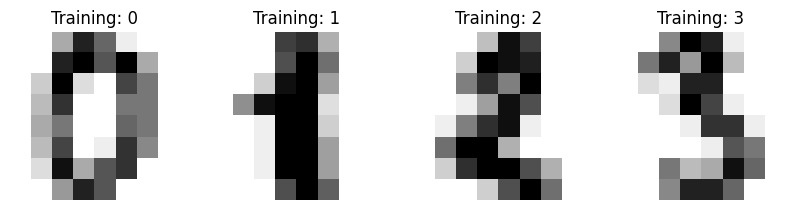
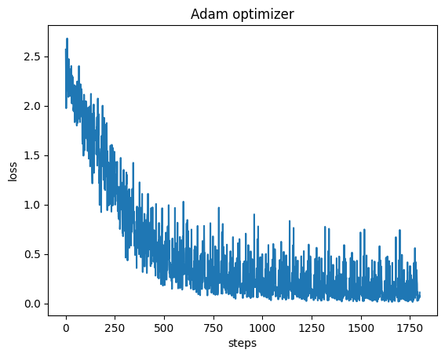

# SimpleGrad

This repository provides a simple implementation of an automatic differentiation (autograd) system, along with a PyTorch-like framework built around it. The focus of this implementation is on code clarity and ease of understanding, making it an excellent resource for learning and exploring the underlying concepts of autograd.

### Key Features:

* Operates on scalar values to prioritize conceptual clarity.
* Designed to help learners visualize and understand the internal workings of automatic differentiation.

### Limitations:

* Not optimized for performance or real-world scalability.
* Operates on scalar values, which may limit its applicability to complex or large-scale computations.

## Requirements
* numpy
* matplotlib
* sklearn
* tqdm

## Implemetations
List of all the methods/utilities that has been implemented in this repo.

#### Layers
* Linear

#### Activations
* LeakyRelu
* Sigmoid
* Softmax

#### Ops (operations)
* Multiplication
* Division
* Addition
* Subtraction
* Log
* Exp

#### Loss Functions
* Cross-Entropy
* MSE

#### Optimizers
* Adam
* SGD

#### Utils
* Plot gradient
* Plot weights

## Demo
Trained an [MLP](https://github.com/DarvinX/SimpleGrad/blob/main/demo_MLP.ipynb) to classify digits dataset (from sklearn)

#### Digits dataset

#### Training loss

