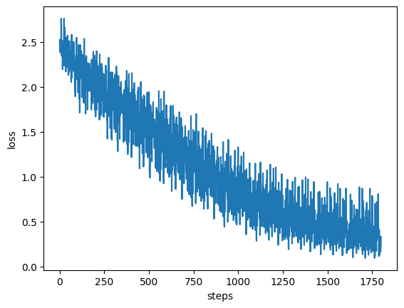

# SimpleGrad

A simple implementation of autograd and a pytorch-like framework around it. This implementation focuses on easy to understand codebase and is not optimized for performace. Use this repo as a learning step, if performance is needed then please prefer pytorch (or any other established framework).

## Requirements
* numpy
* matplotlib
* sklearn
* tqdm

## Demo
Trained an [MLP](https://github.com/DarvinX/SimpleGrad/blob/main/demo_MLP.ipynb) to classify digits dataset (from sklearn)

#### Digits dataset

#### Training loss
